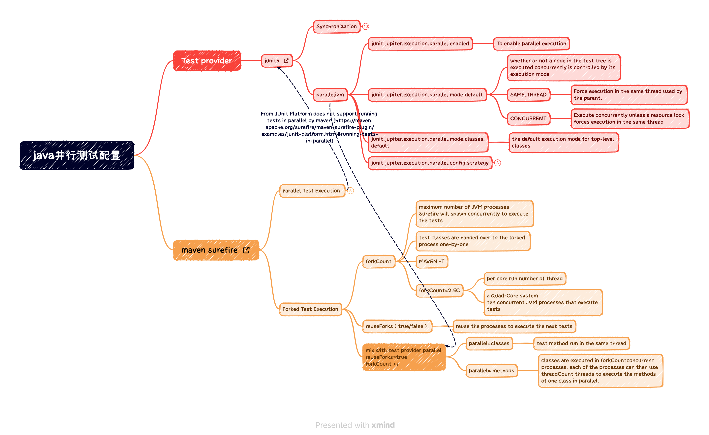

# java 测试并行的几种方法
## TLDR

本文说明了

* 通过`maven surefire`可以通过`fork test execution`使用多进程的方式并行执行java测试
* 及`junit5`通过 `junit.jupiter.execution.parallel`使用线程的方式并行执行java测试
* 以及`maven fork test execution` 和 `junit.jupiter.execution.parallel`同时使用会对测试方法级别的并发产生不同的影响



## maven surefire 的 fork test execution

### maven surefire 并行测试的历史和现状

`maven surefire` 本身提供了两种并行执行测试的模式： 多线程模式的`parallel test execution` 和 多进程模式的`fork test execution`。`parallel test execution` 需要依赖测试套件（例如：TestNG、Junit）来实现，但是最近的 `Junit 5`已经[不再支持 `parallel test execution` ](https://maven.apache.org/surefire/maven-surefire-plugin/examples/junit-platform.html#running-tests-in-parallel)  
**示例**：执行 `make maven-surefire-parallel-thread-execution`   
虽然我在这个示例中配置了`parallel=method`但是我们看到测试实际是依次运行的
``` Bash
[ThreadedStreamConsumer] [INFO] Running com.victoryw.maven.surefire.junit5.parallel.setting.ParallelDemo1Test
[57722]-[main] DEBUG c.v.m.s.j.p.setting.ParallelDemo1 - The method2 is run
[57722]-[main] DEBUG c.v.m.s.j.p.setting.ParallelDemo1 - The method2 is run over
[57722]-[main] DEBUG c.v.m.s.j.p.setting.ParallelDemo1 - The method2 is run
[57722]-[main] DEBUG c.v.m.s.j.p.setting.ParallelDemo1 - The method2 is run over
[57722]-[main] DEBUG c.v.m.s.j.p.setting.ParallelDemo1 - The method is run
[57722]-[main] DEBUG c.v.m.s.j.p.setting.ParallelDemo1 - The method is run over
[ThreadedStreamConsumer] [INFO] Tests run: 3, Failures: 0, Errors: 0, Skipped: 0, Time elapsed: 15.135 s - in com.victoryw.maven.surefire.junit5.parallel.setting.ParallelDemo1Test
[ThreadedStreamConsumer] [INFO] Running com.victoryw.maven.surefire.junit5.parallel.setting.ParallelDemo3Test

```

### fork test execution的执行过程

`maven surefire` 执行 `fork test execution`：
1. 根据 `forkCount` 启动 N 个 `JVM` 进程
2. `maven surefire` 将 一个 `testClass` 放入 一个 进程中运行测试

**示例**： 执行 `make forked-test-execution`, 首先在不同进程(59338,59339)中同时开始执行了两个测试类（`ParallelDemo1Test`, `ParallelDemo3Test`）的用例；在之前的测试类执行完毕后，在进程（59436）中执行 `ParallelDemo2Test`测试类的用例

``` Bash
[ThreadedStreamConsumer] [INFO] Running com.victoryw.maven.surefire.junit5.parallel.setting.ParallelDemo3Test
[ThreadedStreamConsumer] [INFO] Running com.victoryw.maven.surefire.junit5.parallel.setting.ParallelDemo1Test
[59338]-[main] DEBUG c.v.m.s.j.p.setting.ParallelDemo1 - The method2 is run
[59339]-[main] DEBUG c.v.m.s.j.p.setting.ParallelDemo3 - The method8 is run
[59338]-[main] DEBUG c.v.m.s.j.p.setting.ParallelDemo1 - The method2 is run over
[59339]-[main] DEBUG c.v.m.s.j.p.setting.ParallelDemo3 - The method8 is run over
[59338]-[main] DEBUG c.v.m.s.j.p.setting.ParallelDemo1 - The method3 is run
[59339]-[main] DEBUG c.v.m.s.j.p.setting.ParallelDemo3 - The method9 is run
[59338]-[main] DEBUG c.v.m.s.j.p.setting.ParallelDemo1 - The method3 is run over
[59338]-[main] DEBUG c.v.m.s.j.p.setting.ParallelDemo1 - The method is run
[59339]-[main] DEBUG c.v.m.s.j.p.setting.ParallelDemo3 - The method9 is run over
[59339]-[main] DEBUG c.v.m.s.j.p.setting.ParallelDemo3 - The method7 is run
[59338]-[main] DEBUG c.v.m.s.j.p.setting.ParallelDemo1 - The method is run over
[59339]-[main] DEBUG c.v.m.s.j.p.setting.ParallelDemo3 - The method7 is run over
[ThreadedStreamConsumer] [INFO] Tests run: 3, Failures: 0, Errors: 0, Skipped: 0, Time elapsed: 15.127 s - in com.victoryw.maven.surefire.junit5.parallel.setting.ParallelDemo3Test
[ThreadedStreamConsumer] [INFO] Tests run: 3, Failures: 0, Errors: 0, Skipped: 0, Time elapsed: 15.126 s - in com.victoryw.maven.surefire.junit5.parallel.setting.ParallelDemo1Test
[ThreadedStreamConsumer] [INFO] Running com.victoryw.maven.surefire.junit5.parallel.setting.ParallelDemo2Test
[59436]-[main] DEBUG c.v.m.s.j.p.setting.ParallelDemo2 - The method5 is run
[59436]-[main] DEBUG c.v.m.s.j.p.setting.ParallelDemo2 - The method5 is run over
[59436]-[main] DEBUG c.v.m.s.j.p.setting.ParallelDemo2 - The method6 is run
[59436]-[main] DEBUG c.v.m.s.j.p.setting.ParallelDemo2 - The method6 is run over
[59436]-[main] DEBUG c.v.m.s.j.p.setting.ParallelDemo2 - The method4 is run
[59436]-[main] DEBUG c.v.m.s.j.p.setting.ParallelDemo2 - The method4 is run over
[ThreadedStreamConsumer] [INFO] Tests run: 3, Failures: 0, Errors: 0, Skipped: 0, Time elapsed: 15.125 s - in com.victoryw.maven.surefire.junit5.parallel.setting.ParallelDemo2Test

```

### forkCount 的配置
### reuseForks 的配置
### MAVEN -T 的影响


## junit5 的 junit.jupiter.execution.parallel

## 联合应用 fork test execution 和 junit.jupiter.execution.parallel

## 代码库的简单说明
